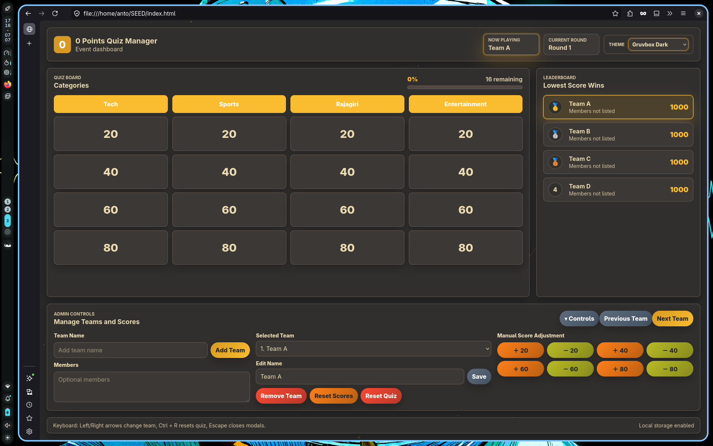
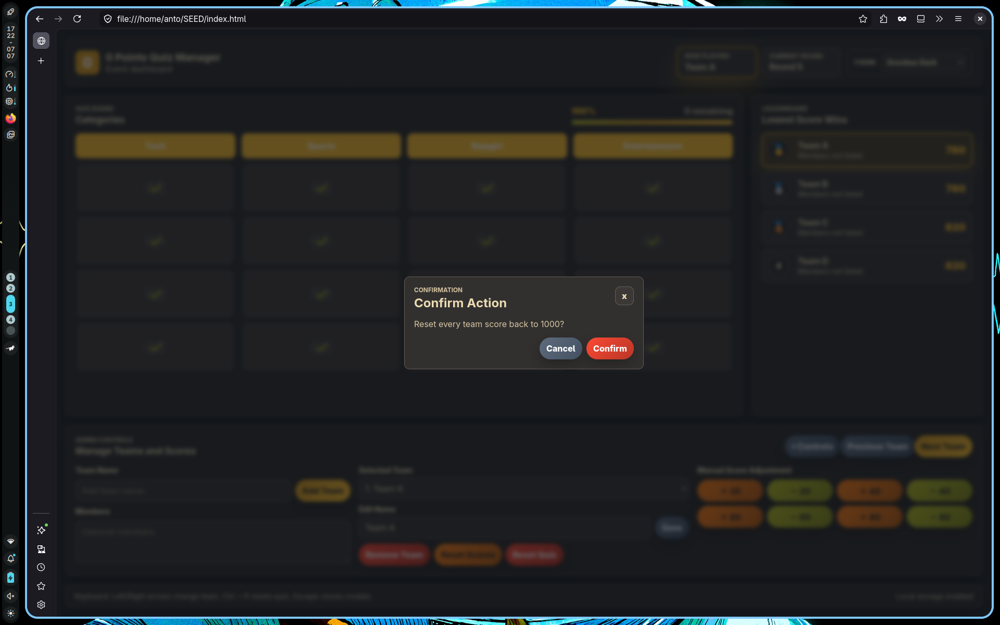
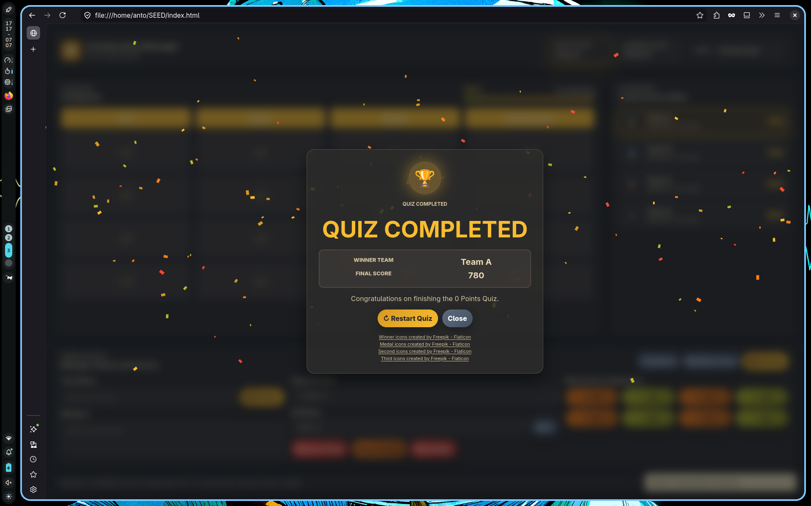

# 0 Points Quiz Manager

A frontend web application built to manage the **0 Points Quiz** event. It provides an interactive dashboard for team management, scoring, turn tracking, and a live leaderboard.

## Features

- Team registration and management
- Dynamic leaderboard (lowest score wins)
- Automatic turn management
- Question board with completion tracking
- Manual score adjustments
- Winner screen with celebration
- Light, Dark & Gruvbox themes
- LocalStorage support
- Responsive UI

## Tech Stack

- HTML5
- CSS3
- JavaScript

## Project Structure

```text
.
├── index.html
├── css/
│   └── style.css
├── js/
│   └── script.js
├── assets/
│   ├── images/
│   └── icons/
└── README.md
```

## How to Run

Clone the repository and open `index.html` in your browser.

```bash
git clone <repository-url>
cd 0-points-quiz
```

Then open `index.html`.

## Screenshots

### Home Dashboard



### Reset Scores



### Winner Screen



## Future Improvements

- Backend integration
- Authentication
- Custom quiz categories
- Export/Import event data

---

Developed for the **RSET SEED Technical Selection Task**.